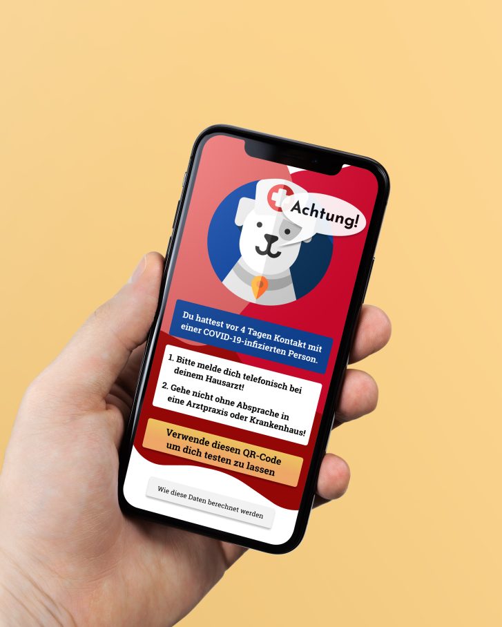

# bluto

    

bluto ist deine Spürnase zur Identifikation von Begegnungen mit SARS-CoV-2-Infizierten über Bluetooth Low Energy und Wi-Fi Direct.

## Übersicht
- [Idee](#idee)
- [Konzept](#konzept)
- [UI](#ui)
- [Komponenten](#komnponenten)
- [Ausblick](#ausblick)

## Idee

Wir möchten eine Applikation bereitstellen, welche eine zuverlässige Nachverfolgbarkeit potentiell ansteckender Kontakte ermöglicht. Datensicherheit ist dabei unser höchstes Gebot.

Die Funktionsweise ist an der App [TraceTogether](https://www.tracetogether.gov.sg/) angelehnt, welche bereits in Singapur erfolgreich eingesetzt wird. Unser Ziel ist es, eine ähnliche Funktionsweise bei maximaler Transparenz und Datensparsamkeit zu schaffen.

## Konzept

### Privacy by Design

Anstatt nur zu versprechen, mit den Daten sparsam umzugehen, haben wir die Anwendung so konzeptioniert, dass möglichst wenig Daten erhoben werden und diese nach Veröffentlichung nicht mehr einer Person zugeordnet werden können. Dies funktioniert so:

Jedes teilnehmende Gerät weist sich für einen bestimmten Zeitraum mittels einer zufällig generierten ID (die UUID v4) aus. In der ID sind keine Informationen über das Gerät gespeichert.

Wird nun ein anderes Gerät mit der bluto-App im Umfeld erkannt, tauschen die beiden Geräte ihre aktuellen IDs aus und speichern diese ab. Nur die beiden kommunizierenden Geräte erhalten die ID des jeweils anderen.

Für den Fall, dass bei einem bluto-Nutzer nun eine stark infektiöse Erkrankung wie COVID-19 diagnostiziert wird, werden seine IDs der letzten 14 Tage (oder einem anderen für die jeweilige Krankheit relevanten Zeitraum) auf den bluto-Server hochgeladen.

Ist eine der hochgeladenen IDs auch auf einem anderen Gerät gespeichert, so war diese Person mit dem Erkrankten offensichtlich in Kontakt. Sie kann nun darüber benachrichtigt werden, dass eine Untersuchung erfolgen sollte. Dabei erfährt sie nicht, wer die erkrankte Person ist.

### Genaue Messung

Ein großer Vorteil dieses Ansatzes ist zudem, dass der Kontakt zwischen zwei Personen gemessen wird. So sind keine aufwändigen Abgleiche zwischen GPS-Tracks notwendig, die zudem häufig ungenau sind oder innerhalb von geschlossenen Gebäuden wie Geschäften oder in der U-Bahn nicht funktionieren.

### Skalierbarkeit

Um die herunterzuladende Datenmenge für einen Nutzer zu begrenzen, clustert bluto die hochgeladenen IDs grob nach Region. So müssen nicht alle verfügbaren IDs von jedem Nutzer heruntergeladen werden, sondern nur die für die Region, in der sich der Nutzer selbst aufgehalten hat.

Durch die Einordnung der Datensätze in verschiedene Regionen lässt sich bei Bedarf die Serverinfrastruktur einfach erweitern. Es können dadurch Server nach Region gestaffelt aufgesetzt werden (beispielsweise ein Server für 6°E-9°E, einer für 9°E-12°E und einer für 12°E-15°E).

Die Datenmenge, die ein Client herunterladen muss, lässt sich hingegen über die Feinheit der Zuordnung zu Regionen einstellen.

Somit bestehen Stellschrauben sowohl um die Auslastung der Backends als auch die Netzwerklast zum Client kontrollieren zu können.

Veraltete Schlüssel werden aus der Datenbank regelmäßig gelöscht, da diese nach einer bestimmten Zeit ohnehin nicht mehr relevant sind.

### Beispieldaten

| uuid | lat | long | week |
| :--- | :-: | :--: | :--: |
| 84261209-d098-4a22-8772-d669e71b3d86 | 52 | 13 | 2020-12 |

## UI

## Komponenten

* [Smartphone App](frontend/README.md)
* [Backend Server](backend/README.md)

## Ausblick

Eine weitere Idee ist es, das Infektionsrisiko über die Dauer und Entfernung zum Kontakt abzuschätzen. Hierfür wird für jede Begegnung die Dauer und die Verläufe der Signalpegel auf dem Gerät gespeichert. Wird eine Begegnung als Kontakt zu einer infizierten Person eingestuft, werden diese Daten ausgewertet und ein Risikowert ermittelt. Eine eventuelle Empfehlung, ob ein Test auf die Krankheit erfolgen sollte, wird dann unter Berücksichtigung der Berechnung ausgegeben.
